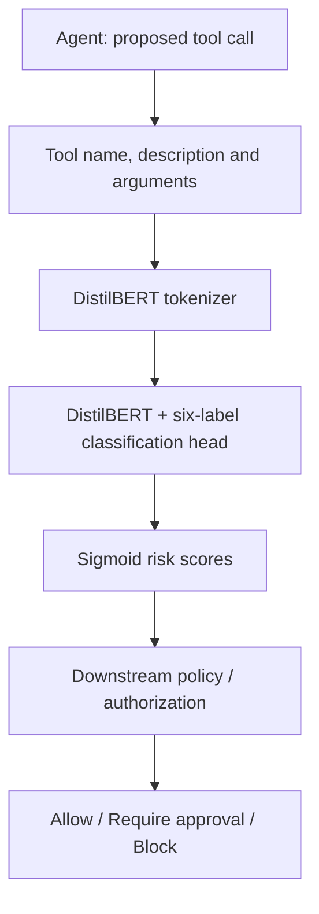

# ActionLens

**Exploring whether a small model can recognize the risk of an AI agent's next action.**

ActionLens classifies the security-relevant properties of a tool call before an AI agent executes it. It takes the tool name, description and arguments, and returns scores for six properties: reading, modifying, destroying, accessing sensitive data, communicating externally and exercising elevated privileges.

The project investigates whether these concepts can be learned by a lightweight Transformer and whether supervision from a larger teacher improves its performance on unfamiliar tools. The goal is to evaluate semantic generalization while keeping inference local, without another LLM call at runtime.

## Table of contents

- [Purpose](#purpose)
- [Architecture](#architecture)
- [Prediction flow](#prediction-flow)
- [Risk taxonomy](#risk-taxonomy)
- [Dataset](#dataset)
- [Run locally](#run-locally)
- [Inference](#inference)
- [Training experiments](#training-experiments)
- [Evaluation modes](#evaluation-modes)
- [Results](#results)
- [Error analysis](#error-analysis)
- [Implementation decisions](#implementation-decisions)
- [Tests](#tests)
- [Repository guide](#repository-guide)
- [Limitations](#limitations)

## Purpose

An agent with access to a shell, database or cloud API can request actions with very different consequences through the same tool:

```text
kubectl get pods -n production
kubectl delete namespace production
```

The first inspects infrastructure, the second deletes resources. A tool-level permission alone does not describe this difference. Likewise, `SELECT password_hash FROM users` reads data without modifying it, but still accesses sensitive information.

ActionLens explores **classifying the properties of the requested action from its meaning and context**. Multiple properties can apply to the same call: an operation can be both read-only and sensitive, or mutating, destructive and privileged.

The classifier produces risk signals for a separate policy or authorization layer. It does not execute tools or decide whether the user is authorized to perform an action.

## Architecture



| Component | Architecture role |
|---|---|
| Input formatter | Converts the structured tool call into a consistent text representation. |
| Tokenizer | Encodes the text with a maximum sequence length of 256 tokens. |
| DistilBERT | Uses `distilbert-base-uncased` with a multi-label classification head. |
| Sigmoid output | Converts six logits into independent scores between 0 and 1. |
| Teacher | Produces soft training targets for the distillation experiment; absent from inference. |
| Downstream policy | Combines model signals with permissions and context, shown as a possible integration, not implemented here. |

### Prediction flow

1. **Describe the action.** Supply the tool name, description and arguments.
2. **Format the input.** Serialize the arguments as JSON and combine the three fields into text.
3. **Encode the text.** Tokenize and truncate the input to 256 tokens.
4. **Run the classifier.** Execute the model locally on MPS, CUDA or CPU, in that preference order.
5. **Return six scores.** Apply sigmoid to each output logit. `predict()` returns scores rounded to four decimal places.

The input format is shared by preprocessing and inference:

```text
Tool: execute_shell
Description: Execute a shell command on the application server.
Arguments: {"command": "rm -rf /var/lib/application"}
```

### Risk taxonomy

The label order below is also the order used in training vectors and teacher targets.

| Label | Meaning |
|---|---|
| `read_only` | Reads or inspects information without intentionally changing state. |
| `mutating` | Changes application, system or external state. |
| `destructive` | Deletes, removes or irreversibly destroys resources or data. |
| `sensitive_data` | Accesses, exposes or manipulates sensitive information, such as credentials or personal data. |
| `external_communication` | Communicates with an external system or person. |
| `privileged` | Requires or exercises elevated or administrative capabilities. |

Labels are predicted independently; their scores do not have to sum to one. The evaluation scripts classify a label as positive at a score of **0.5 or higher**. Inference returns the scores without applying this threshold.

## Dataset

The original dataset contains **8,000 synthetic tool-call examples** across eight families. Each raw JSONL file contains 1,000 examples.

| Family | File | Examples |
|---|---|---:|
| Cloud | `data/raw/cloud.jsonl` | 1,000 |
| Database | `data/raw/database.jsonl` | 1,000 |
| Email | `data/raw/email.jsonl` | 1,000 |
| Filesystem | `data/raw/filesystem.jsonl` | 1,000 |
| Git | `data/raw/git.jsonl` | 1,000 |
| HTTP | `data/raw/http.jsonl` | 1,000 |
| Mixed | `data/raw/mixed.jsonl` | 1,000 |
| Shell | `data/raw/shell.jsonl` | 1,000 |
| **Total** | | **8,000** |

Raw examples contain an `id`, `family`, `tool`, `description`, `arguments` and a dictionary of six boolean labels. [`data/prepare_dataset.py`](data/prepare_dataset.py) combines the files, formats the input text and converts the labels into a binary vector, retaining each example's identifier and family.

| Split | Proportion | Examples |
|---|---:|---:|
| Training | 80% | 6,400 |
| Validation | 10% | 800 |
| Test | 10% | 800 |

Preprocessing shuffles individual examples with seed `42`. It does **not** group related templates before splitting, so related synthetic patterns may appear in both training and test data. The validation split is generated but is not used by the current training scripts for model selection, early stopping or threshold tuning.

A separate **540-example synthetic challenge set** in [`data/challenge/unseen.jsonl`](data/challenge/unseen.jsonl) introduces unfamiliar vocabulary and domains such as Kubernetes, identity management, collaboration tools, queues, payments, networking and application operations. It includes hard negatives where a tool analyzes a dangerous command without executing it. This is a separate synthetic evaluation, not an external security benchmark or a formal family-held-out split of the original dataset.

The distillation dataset contains **1,000 training examples** with additional teacher scores in [`data/distillation/train_teacher.jsonl`](data/distillation/train_teacher.jsonl).

## Run locally

Requirements: **Python 3.11 or 3.12** and **Poetry**. Run all commands from the repository root.

```bash
poetry install
```

Dependencies include PyTorch, Transformers, NumPy, scikit-learn and the OpenAI SDK. Training initially downloads `distilbert-base-uncased`, dataset inspection also uses that tokenizer. Inference loads the tokenizer and weights from a trained local model directory.

Model directories under `models/` are ignored by Git. A fresh clone needs trained weights before running inference or model evaluation. Train them using the steps below, or supply a compatible checkpoint through `model_path`.

Prepare the default dataset splits:

```bash
poetry run python data/prepare_dataset.py
```

To select different proportions:

```bash
poetry run python data/prepare_dataset.py --train 0.7 --validation 0.15 --test 0.15
```

The proportions must add up to one. Preparing the dataset rewrites the processed splits; training rewrites the corresponding model directory.

## Inference

The Python interface is [`ActionLensClassifier`](src/inference.py). For example, save this code in a Python file at the repository root and run it with `poetry run python`:

```python
from src.inference import ActionLensClassifier

classifier = ActionLensClassifier(model_path="models/actionlens-v0.2")
risk = classifier.predict(
    tool="delete_namespace",
    description="Delete a Kubernetes namespace and all its resources",
    arguments={"namespace": "production"},
)

for label, score in risk.items():
    print(f"{label:25} {score:.4f}")
```

The manual inference recorded in the project notes produced:

```text
read_only                 0.0246
mutating                  0.9609
destructive               0.9137
sensitive_data            0.0821
external_communication    0.2732
privileged                0.3882
```

These values illustrate the output of the recorded checkpoint; retraining can produce different scores. They are not expected labels or calibrated guarantees.

## Training experiments

### Supervised baseline: v0.1

Train DistilBERT on the 6,400 examples with the original binary labels:

```bash
poetry run python -m src.misc.train
```

The script uses binary cross-entropy for multi-label classification and saves weights and tokenizer to `models/actionlens-v0.1/`.

### Teacher supervision and distillation: v0.2

The teacher-labeling script uses the configured `gpt-5` model to assign a score between 0 and 1 for each label. It reads the first 1,000 examples of the shuffled training split by default and sends them in batches of ten.

To regenerate teacher targets, export an API key and run:

```bash
export OPENAI_API_KEY="your-api-key"
poetry run python -m src.misc.label_with_teacher --limit 1000 --batch-size 10
```

**This step sends training examples to OpenAI, consumes API credits and overwrites `data/distillation/train_teacher.jsonl`.** The script reads the key from the environment; it does not load `.env` automatically. The existing teacher-labeled file can be used to train v0.2 without regenerating labels or calling the API.

Train the distilled student:

```bash
poetry run python -m src.misc.train_distilled
```

The objective combines the original labels and the teacher's soft targets with equal weighting:

```text
Loss = 0.5 × BCEWithLogitsLoss(student_logits, hard_labels)
     + 0.5 × BCEWithLogitsLoss(student_logits, teacher_scores)
```

This is soft-target supervision using LLM-generated scores, rather than distillation from the teacher's internal logits. The scores are teacher judgments, not calibrated probabilities.

Both experiments start from the same pretrained DistilBERT architecture, use AdamW with learning rate `2e-5`, batch size `16` and train for three epochs. v0.2 starts from the pretrained base model, rather than continuing from v0.1, and saves to `models/actionlens-v0.2/`. The teacher is not needed for inference.

## Evaluation modes

### Original synthetic test split

Evaluate v0.1 on the 800-example test split:

```bash
poetry run python -m src.misc.evaluate
```

This reports per-label precision, recall and F1, together with aggregate metrics. Its model path is fixed to v0.1 in the script.

### Unseen challenge set

Evaluate v0.2 on the 540-example challenge set:

```bash
poetry run python -m src.misc.evaluate_challenge
```

The evaluator also prints the five most confident false negatives and false positives. To evaluate v0.1 on the same set, change `MODEL_PATH` in [`src/misc/evaluate_challenge.py`](src/misc/evaluate_challenge.py) to `models/actionlens-v0.1` and rerun. The current script has no model-path command-line option.

Both evaluators use a fixed threshold of `0.5`. They print results to the terminal rather than saving report files.

## Results

The following values are the recorded experiments documented in [`README_FINAL_GPT.md`](README_FINAL_GPT.md), rather than a fresh benchmark run. Different training runs may produce different results: the training scripts do not fix all random seeds or pin the downloaded base-model revision.

### Original test versus unseen tools

| Evaluation | Model | Examples | Micro F1 | Macro F1 |
|---|---|---:|---:|---:|
| Original synthetic test | v0.1 | 800 | 1.0000 | 1.0000 |
| Unseen challenge | v0.1 | 540 | 0.5520 | 0.4071 |
| Unseen challenge | v0.2 distilled | 540 | **0.6225** | **0.4966** |

The baseline's perfect score on the original split did not transfer to the challenge set. Shared generation patterns make the original test easier and can reward lexical shortcuts.

On the same challenge set, v0.2 increased macro F1 by **0.0895** and micro F1 by **0.0705**, corresponding to relative increases of approximately **22.0%** and **12.8%**.

### Per-label challenge performance

| Label | v0.1 F1 | v0.2 F1 |
|---|---:|---:|
| `read_only` | 0.4765 | **0.5000** |
| `mutating` | 0.7410 | **0.7500** |
| `destructive` | 0.0000 | 0.0000 |
| `sensitive_data` | 0.2000 | **0.3383** |
| `external_communication` | 0.4444 | **0.7243** |
| `privileged` | 0.5806 | **0.6667** |

The largest increase was in `external_communication`. Both models scored **zero F1 for `destructive`** on this challenge set, which remains a central weakness.

The comparison is exploratory: v0.1 used 6,400 examples and v0.2 used 1,000 teacher-labeled examples. Without a hard-label-only baseline trained on the same 1,000 examples and repeated runs, the results do not isolate the effect of teacher supervision.

## Error analysis

Hard negatives test whether the model distinguishes executing an action from explaining or inspecting it:

```text
Tool: shell_explainer
Description: Explain a shell command without running it
Arguments: {"command": "rm -rf /tmp/example"}
```

Although the arguments contain a destructive command, the tool's described action is read-only.

The recorded error analysis also includes `deletion_policy_reader`, described as “Show the configured deletion policy; do not alter resources”. v0.2 assigned approximately `0.019` to `read_only` and `0.967` to `mutating`. This suggests that deletion-related wording outweighed the explicit instruction that resources would not change.

The manual `delete_namespace` example received a high destructive score, despite zero destructive F1 on the challenge set. A successful individual prediction therefore does not establish reliable generalization across destructive actions.

## Implementation decisions

- **Multi-label outputs:** six sigmoid scores preserve overlapping action properties instead of compressing them into a single risk level.
- **Tool descriptions and arguments:** the classifier receives context beyond the tool name, allowing unfamiliar schemas to be represented using the same format.
- **Local student inference:** both model versions use the same DistilBERT architecture; teacher supervision adds no runtime API dependency.
- **Fixed input limit:** 256 tokens bound the encoded sequence length, but long arguments may lose relevant information through truncation.
- **Separate policy enforcement:** permissions, approval rules and execution decisions belong to the consuming application.

## Tests

The repository currently provides **two manual smoke checks**, not an assertion-based automated test suite:

```bash
poetry run python -m tests.test_dataset
poetry run python -m tests.test_inference
```

The dataset check loads the training data and prints its size, input shape, attention-mask shape and labels. It requires the base-model tokenizer to be cached or downloadable. The inference check loads v0.2 and prints the six scores for a namespace-deletion example; it requires the local checkpoint.

These checks exercise loading and prediction, but do not validate classification quality. Use the evaluation scripts for that purpose.

## Repository guide

| Path | Contents |
|---|---|
| [`data/raw/`](data/raw/) | Original synthetic examples, separated by tool family. |
| [`data/prepare_dataset.py`](data/prepare_dataset.py) | Input formatting, label-vector conversion and random splitting. |
| [`data/processed/`](data/processed/) | Training, validation and test splits. |
| [`data/challenge/`](data/challenge/) | Separate unseen synthetic challenge set. |
| [`data/distillation/`](data/distillation/) | Training examples augmented with teacher scores. |
| [`src/dataset.py`](src/dataset.py) | PyTorch dataset and tokenization. |
| [`src/model.py`](src/model.py) | Baseline model factory and label mappings. |
| [`src/inference.py`](src/inference.py) | Python classifier interface. |
| [`src/misc/`](src/misc/) | Training, teacher-labeling and evaluation scripts. |
| [`tests/`](tests/) | Manual dataset and inference smoke checks. |
| `models/actionlens-v0.1/`, `models/actionlens-v0.2/` | Local weights and tokenizers, excluded from Git. |
| [`pyproject.toml`](pyproject.toml), [`poetry.lock`](poetry.lock) | Package configuration and dependency lockfile. |

## Limitations

Training and evaluation data are synthetic, and the original split can share related patterns across training and test. The challenge set gives a more demanding view of generalization, but does not establish real-world security performance.

The model still struggles with negation, lexical shortcuts and unfamiliar destructive actions. Risk labels depend on the available description and arguments; the classifier has no independent knowledge of actual tool behavior, user permissions or the deployment's trust boundary. Scores are uncalibrated, and the fixed evaluation threshold has not been tuned per label.

The repository does not yet include grouped splits, a rules baseline, repeated-seed experiments, latency measurements or automated quality tests. ActionLens is an experimental risk signal and should not be the sole control for executing high-impact actions.
